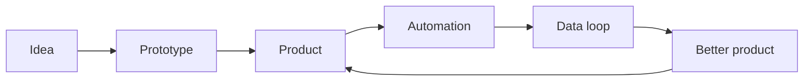

<div align="center">

# Prayas Tiwari

### Builder across AI, product, automation, data, and real-world operations.

I turn rough ideas into shipped systems: web apps, agents, internal tools, data pipelines, automation workflows, and products that help people move faster.

</div>

---

## What I do

I work across multiple kinds of products and problem spaces. Some days that means building polished user-facing apps. Other days it means wiring together APIs, background workers, data pipelines, AI workflows, dashboards, integrations, or tools that make an annoying manual process disappear.

The common thread: I like software that does real work.

```txt
Product engineering    AI workflows        Automation
Data systems           Full-stack apps      Internal tools
Integrations           Founder projects     Fast prototypes
```

## Builder mode

- I enjoy going from blank page to working product.
- I care about speed, taste, and practical usefulness.
- I like systems that connect messy real-world inputs to clean user experiences.
- I am comfortable moving between frontend, backend, data, infra, and product thinking.
- I use AI as a building material, not just a feature.

## Current interests



## Things I build

| Theme | Examples |
| --- | --- |
| AI products | Agents, copilots, retrieval flows, workflow automation, reasoning tools |
| Full-stack apps | Dashboards, portals, landing pages, product surfaces, admin tools |
| Data systems | Pipelines, enrichment, sync jobs, classification, monitoring |
| Integrations | OAuth, webhooks, CRMs, email, documents, third-party APIs |
| Automation | Background workers, scheduled jobs, inbox flows, internal operations |
| Experiments | Fast prototypes, founder ideas, small tools, weird useful things |

## Stack I like

<p>
  
</p>

## Contribution graph, but bigger energy

<div align="center">

<picture>
  <source media="(prefers-color-scheme: dark)" srcset="https://raw.githubusercontent.com/prayastiwari/prayastiwari/output/github-contribution-grid-snake-dark.svg" />
  <source media="(prefers-color-scheme: light)" srcset="https://raw.githubusercontent.com/prayastiwari/prayastiwari/output/github-contribution-grid-snake.svg" />
  
</picture>

<br />
<br />


</div>

## My bias

Build the thing. Ship the first version. Learn from the surface area. Make it cleaner. Make it faster. Make it useful enough that someone actually wants it open in another tab.

---

<div align="center">

**AI systems | Product engineering | Automation | Data | Founder projects**

</div>
